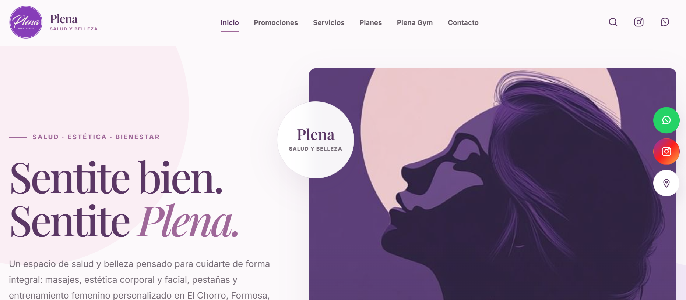

# Plena — Salud y Belleza

Sitio web institucional e informativo desarrollado para **Plena — Salud y Belleza**, orientado a presentar sus servicios de estética, bienestar y cuidado personal de forma clara, visual y accesible desde distintos dispositivos.

El proyecto está desarrollado con **HTML, CSS y JavaScript vanilla**, sin necesidad de base de datos, backend, gestor de paquetes ni proceso de compilación.

> **Estado del proyecto:** actualmente se encuentra en proceso de desarrollo, actualización y puesta a punto. La versión desplegada tiene fines de demostración y evaluación del sitio.

> **Importante:** los precios, promociones, planes y demás valores comerciales visibles en esta versión corresponden a información utilizada durante etapas anteriores del proyecto y **no reflejan necesariamente los precios ni condiciones comerciales vigentes de Plena**.

## Screenshots

### Página de inicio



## Repositorio y publicación

* **Repositorio:** [github.com/ladardrgz/plena-salud-belleza](https://github.com/ladardrgz/plena-salud-belleza)
* **Demo:** [plena-estetica-salud-y-belleza-integral.ldrweb.workers.dev](https://plena-estetica-salud-y-belleza-integral.ldrweb.workers.dev/)
* **Infraestructura:** Cloudflare.

El dominio utilizado actualmente corresponde a un **subdominio de demostración** y no representa un dominio institucional definitivo.

En una implementación definitiva, el proyecto debería utilizar el dominio oficial definido por la organización y actualizarse con la información comercial, institucional y de contacto vigente.

## Tecnologías

* HTML5
* CSS3
* JavaScript
* Diseño responsive
* Git y GitHub
* Cloudflare

## Estructura

```text
/
├── public/
│   ├── favicon/
│   │   └── favicon.ico
│   └── images/
│       └── branding/
│           └── logotipo-plena.png
├── screenshots/
│   └── inicio.png
├── src/
│   ├── css/
│   │   ├── main.css
│   │   ├── components.css
│   │   └── responsive.css
│   └── js/
│       └── main.js
├── index.html
├── politica-turnos.html
├── terminos-y-condiciones.html
├── privacidad.html
└── README.md
```
* `index.html`: página principal.
* `src/css/main.css`: estilos principales del sitio.
* `src/css/components.css`: componentes, modal de WhatsApp y estilos de páginas informativas.
* `src/css/responsive.css`: adaptaciones responsive.
* `src/js/main.js`: navegación, búsqueda local, animaciones y modal de WhatsApp.
* `public/images/`: recursos gráficos organizados por función.
* `public/favicon/`: favicon del sitio.
* `screenshots/`: capturas utilizadas para documentar visualmente el proyecto.

La carpeta heredada `Images/` contiene archivos que actualmente no están referenciados por el sitio. Se conservaron para evitar eliminar recursos heredados sin una revisión previa.

## Integración con WhatsApp

El enlace principal de contacto se configura mediante la constante `CONTACT.whatsapp` ubicada al comienzo de:

```text
src/js/main.js
```

Los mensajes específicos correspondientes a cada llamada a la acción se mantienen mediante el atributo `data-whatsapp-query` de los enlaces definidos en `index.html`.

Los elementos identificados mediante `data-whatsapp-cta` muestran primero el aviso informativo correspondiente antes de continuar hacia WhatsApp.

## Información y políticas

Las páginas informativas se encuentran separadas según su finalidad:

* Condiciones de turnos, cancelaciones y packs: `politica-turnos.html`.
* Información general y condiciones del sitio: `terminos-y-condiciones.html`.
* Información sobre datos y servicios externos: `privacidad.html`.

Las condiciones comerciales, legales, fiscales, sanitarias, precios y promociones deben ser revisadas y validadas por el titular antes de considerar una versión como definitiva.

## Ejecución local

Al tratarse de un sitio estático, puede ejecutarse mediante Apache desde XAMPP.

Por ejemplo:

```text
http://localhost/Plena/
```

También puede utilizarse cualquier servidor HTTP estático compatible.

Servir el proyecto mediante HTTP permite comprobar correctamente las rutas, recursos y servicios externos utilizados por el sitio.

## Modificaciones futuras

* Actualizar precios, promociones y servicios con información vigente.
* Revisar la información institucional antes de una publicación definitiva.
* Configurar un dominio oficial para producción.
* Mantener los archivos HTML en la raíz mientras no se incorpore un sistema de rutas.
* Incorporar imágenes propias dentro de la categoría correspondiente en `public/images/`.
* Mantener rutas relativas consistentes al reorganizar archivos.
* Centralizar los datos de contacto compartidos para evitar duplicaciones.
* Revisar periódicamente las políticas y condiciones publicadas.
- Mantener `rel="noopener noreferrer"` en enlaces externos con `target="_blank"`.
- Antes de publicar, revisar enlaces internos, consola del navegador, vista móvil y ausencia de overflow horizontal.
